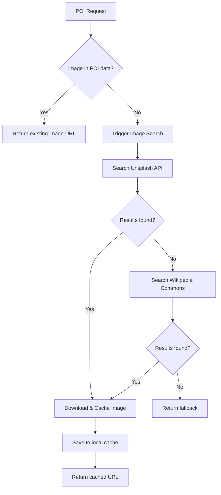

# Plan: Automatic Image Discovery for POIs

## Goal
Automatically find and fetch images for Points of Interest (POIs) when no image is provided in the static data.

## Current State
- POIs are defined statically in `backend/main.py` with hardcoded Unsplash URLs
- If an image fails to load or isn't provided, a fallback SVG is shown
- No automatic image search capability exists

## Proposed Solution

### Architecture

### API Options for Image Search
1. **Unsplash API** - Requires API key, 50 requests/month free
2. **Wikipedia/Wikimedia Commons API** - Free, no key required
3. **Pexels API** - Free tier available
4. **Pixelpoint API** - Free tier

### Implementation Steps

#### Step 1: Add Image Search Function
- Create `search_image(poi_name, city)` function in backend
- Use Wikipedia API first (free, no key)
- Fallback to Unsplash if Wikipedia fails

#### Step 2: Implement Caching
- Cache downloaded images in `backend/static/images/`
- Store image metadata in JSON file
- Check cache before making API calls

#### Step 3: Integrate with POI Endpoint
- Modify `/poi/{poi_id}/audio` to fetch image if missing
- Return the discovered image in the response

#### Step 4: Update Frontend
- Simplify image loading to use returned URL directly
- Remove complex multi-strategy fallback

### Files to Modify
1. `backend/main.py` - Add image search function
2. `backend/static/images/` - Create cache directory
3. `citywhisper_prototype.html` - Simplify image loading

### Priority
- **High**: Implement Wikipedia Commons search (free, reliable)
- **Medium**: Add Unsplash as fallback
- **Low**: Add caching layer
